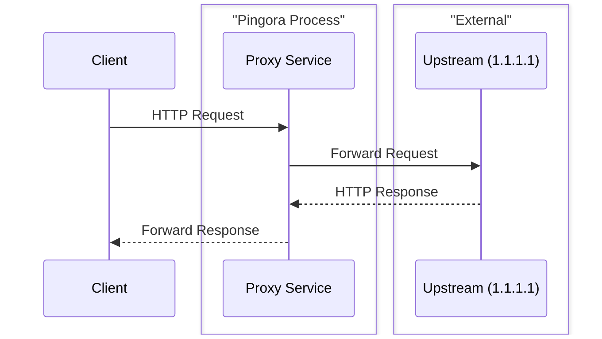
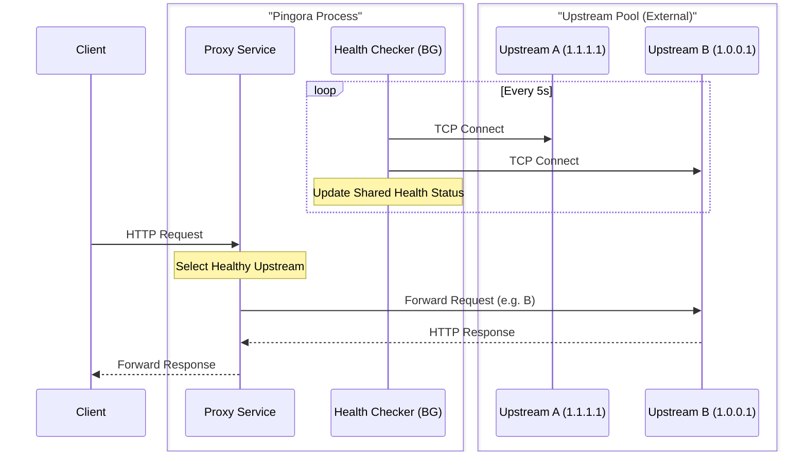
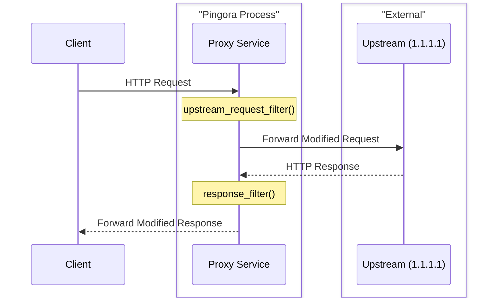

# Pingora Sample Implementations

- [Pingora Sample Implementations](#pingora-sample-implementations)
  - [Project Architecture (Best Practices)](#project-architecture-best-practices)
  - [Directory Structure \& Logic Flow](#directory-structure--logic-flow)
    - [1. `simple_proxy`](#1-simple_proxy)
    - [2. `load_balancer`](#2-load_balancer)
    - [3. `header_filter`](#3-header_filter)
  - [How to Run](#how-to-run)
    - [1. Simple Proxy](#1-simple-proxy)
    - [2. Load Balanced Proxy](#2-load-balanced-proxy)
    - [3. Header Filter](#3-header-filter)
  - [Technical Summary](#technical-summary)

This project contains several sample implementations of [Pingora](https://github.com/cloudflare/pingora), optimized for macOS and managed as a **Rust Workspace**.

## Project Architecture (Best Practices)

This project follows the **Workspace Inheritance** pattern:

- **Centralized Dependencies**: All shared library versions (Pingora, Tokio, etc.) are defined in the root `Cargo.toml`.
- **Consistent Builds**: Ensures all sample crates use the exact same version of Pingora.
- **Git Integration**: Directly references the Pingora GitHub repository to ensure a stable, buildable version.

## Directory Structure & Logic Flow

### 1. `simple_proxy`

A clean, simple HTTP proxy that forwards requests to `1.1.1.1`.



### 2. `load_balancer`

Balances traffic between multiple upstreams with TCP health checks.



### 3. `header_filter`

Demonstrates interception points within the proxy logic.



## How to Run

### 1. Simple Proxy

```bash
RUST_LOG=info cargo run -p simple_proxy
```

Test: `curl -v http://127.0.0.1:6188 -H "Host: one.one.one.one"`

### 2. Load Balanced Proxy

```bash
RUST_LOG=info cargo run -p load_balancer
```

### 3. Header Filter

```bash
RUST_LOG=info cargo run -p header_filter
```

Test: `curl -i http://127.0.0.1:6188 -H "Host: one.one.one.one"`

## Technical Summary

- **Framework**: [Pingora](https://github.com/cloudflare/pingora)
- **Features**: `proxy`, `lb`, `openssl`
- **Customization**:
  - `upstream_peer`: Define routing logic.
  - `upstream_request_filter`: Modify request before it hits upstream.
  - `response_filter`: Modify response before it hits client.
  - `background_service`: Manage background tasks like health checks.
